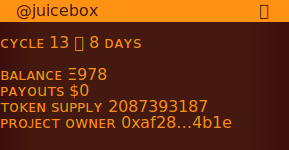

# Juicebox Token Resolver

Creates onchain SVG Metadata for all Juicebox projects on [JBDirectory V3](https://docs.juicebox.money/dev/api/contracts/jbdirectory/).

## Deployed contracts

### Mainnet

- StringSlicer.sol [eth:0xaDE1ae7bCcc2Cb84De0431a70cceB5f1DE0E2c9b](https://etherscan.io/address/0xade1ae7bccc2cb84de0431a70cceb5f1de0e2c9b)
- LibColor [eth:0x53aD3C068B6bf487c1bFE8694C8a5b5546b43063](https://etherscan.io/address/0x53ad3c068b6bf487c1bfe8694c8a5b5546b43063)
- DefaultUriResolver [eth:0x62BC9F7daE47676B16EE95719c4B78Bdb5e9f974](https://etherscan.io/address/0x62BC9F7daE47676B16EE95719c4B78Bdb5e9f974)
- TokenUriResolver [eth:0x2c39bb41e2af6bec6c3bb102c07c15eda648a366](https://etherscan.io/address/0x2c39bb41e2af6bec6c3bb102c07c15eda648a366)

### Goerli

- StringSlicer.sol [gor:0x2cfab22421a948dc7dc27f2b95ade16f108b6639](https://goerli.etherscan.io/address/0x2cfab22421a948dc7dc27f2b95ade16f108b6639)
- LibColor [gor:0xb594f2a65dbe407e579bb1a6aef4fae641408812](https://goerli.etherscan.io/address/0xb594f2a65dbe407e579bb1a6aef4fae641408812)
- DefaultUriResolver [gor:0x9d7a1a7296fd2debd5fd9f48c15830d0aac3c092](https://goerli.etherscan.io/address/0x9d7a1a7296fd2debd5fd9f48c15830d0aac3c092)
- TokenUriResolver [gor:0x082d3969f2b7988b0362e8bd4f2af9bbd2fed36c](https://goerli.etherscan.io/address/0x082d3969f2b7988b0362e8bd4f2af9bbd2fed36c)

## Getting started

This repo relies on Mainnet forking for its tests. This approach allows tests to surface real chain data, and avoids the need to redeploy the entire Juicebox protocol, Juicebox Project Handles, and ENS protocol, as well as instantiating projects, .eth addresses, and handles, before running its own test. The tradeoff is that you need access to an RPC to test the repo.

### Installation

1. `git clone git@github.com:jbx-protocol/juice-token-resolver.git` or `git clone https://github.com/jbx-protocol/juice-token-resolver.git` this repo.
2. Install [Foundry](https://book.getfoundry.sh/getting-started/installation.html), or update Foundry with `foundryup`.
3. `cd` into the directory and call `forge install && yarn install` to install dependencies.
4. Rename `.env-example` to `.env` and fill out the fields. You can generate a throwaway private key with `cast wallet`. You can get a free RPC API key from Infura, Alchemy, and other providers listed on https://ethereumnodes.com/.

## Testing

⚠️ Security note ⚠️ This repo's tests use forge's `ffi` to save SVG images to disk and open them in your default SVG reader (usually the browser). This rendering approach means that malicious updates to this repo, or forks thereof, could allow Node to execute code on your system with filesystem access, and open files in your browser or other applications. Please be careful to check that no malicious changes have been introduced to the code before running tests. A dead giveaway would be unverified commits to the repo, or commits from an unexpected contributor. This code is provided as-is with no guarantee or warranty.

### Run all tests

Run `forge test -v --ffi` to run all test. 

### Test _only_ the default SVG output

Run `forge test -v --ffi --match-test testGetDefaultMetadataDirectoryV3Controller3_1`

*This test outputs the default SVG for a JBDirectoryV3 Controller3_1 project to `src/onchain.svg`.*

## Deploying

Deploy all contracts to Goerli: `forge script script/Goerli_Deploy.s.sol --rpc-url $GOERLI_RPC_URL --broadcast --verify`

Deploy only the DefaultTokenUriResolver to Goerli: `forge script script/Goerli_Deploy_DeafultResolverOnly.s --rpc-url $GOERLI_RPC_URL --broadcast --verify`

Deploy all contracts to Mainnet: `forge script script/Mainnet_Deploy.s.sol --rpc-url $MAINNET_RPC_URL --broadcast --verify`

Deploy only the DefaultTokenUriResolver to Mainnet: `forge script script/Mainnet_Deploy_DefaultResolverOnly.s.sol --rpc-url $MAINNET_RPC_URL --broadcast --verify`

## Design

### TokenUriResolver.sol
[JBProjects](https://docs.juicebox.money/dev/api/contracts/jbprojects/)'s `tokenURI(uint256 _projectId)` function will call this contract's `getUri(uint256 _projectId)` function. TokenUriResolver will check if the given project has a custom resolver set. If so, it will call `getUri(uint256 _projectId)` on that contract. If not, or if that call to the custom resolver fails, it will call the `getUri` function on the DefaultUriResovler. 

### DefaultUriResolver.sol

This resolver generates metadata including an onchain SVG for each JBProject using the [JBDirectory](https://docs.juicebox.money/dev/api/contracts/jbdirectory/) v3 based on values returned form its primary ETH terminal. This Default resolver allows project owners to customize the color of their project's NFT metadata with three theme colors. 

For projects that are not configured to use this directory, the resolver will return a basic metadata description informing the project owner that they can get rich realtime metadata by upgrading to JBDirectory V3. 

#### Layout
Each row of the output SVG is 30 characters long. The Capsules typeface is monospaced, so as long as each row is composed of 30 characters, it will fit the image perfectly. Each row begins and ends with two space characters for visual symmetry.

Unicode and small cap characters are used to enhance aesthetics of the output SVG. These characters are sometimes composed of multiple bytes. For example, while the character `L` [is one byte](https://mothereff.in/byte-counter#L), the small cap `ʟ` [is two bytes](https://mothereff.in/byte-counter#%CA%9F). The version of the Capsules typeface that was stored on Ethereum did not include intelligent small caps assignment, and so we are forced to manually specify the small caps variant.

String length is calculated onchain using `bytes(string).length`. As a result, naively counting each byte as a single display character would fail for unicode and small caps, which may constitute more bytes, but only one monospaced visual character output. Thus calls to the `pad` function rely on passing desired `targetLength` values. If we're drawing the left side of a row, we might concatenate a string composed of two spaces with a right-padded string of 13 characters. If the string has no special characters, then we can simply call `pad(false, "L", 13)`, but if the string contains a special character, we'll have to add the number of extra bytes needed to represent it to the third argument: `pad (false, "ʟ", 14)`.

## Additional resources

- Useful byte length checker https://mothereff.in/byte-counter

## Credits

This project would not have been possible without the following contributions. Thank you!

- [Capsules](https://cpsls.app/) is an onchain typeface by [Peripheralist](https://github.com/peripheralist/typeface).
- The `ffi` script and `open.js` was developed by [Jeton Connu](https://github.com/jeton-connu).
- [Dr.Gorilla](https://github.com/drgorillamd) provided devops support during the development of this project.
- [Jango](https://github.com/mejango) and the Juicebox Contract Crew created the Juicebox protocol.
